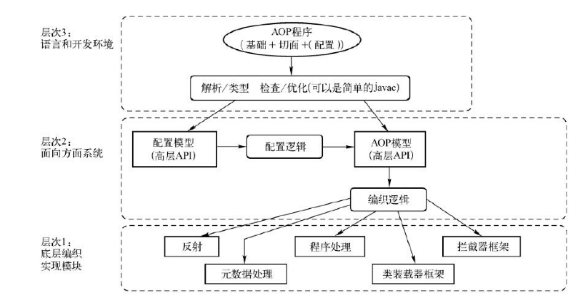

## Spring 核心：AOP

面向方面编程或面向切面编程。是一种新的模块化机制，用来描述分散在对象、类或函数中的横切关注点。从关注点中分离出横切关注点是面向切面的程序的核心概念。分离关注二点使解决特定领域问题的代码从业务逻辑中独立出来，业务逻辑的代码中不再含有针对特定领域问题代码的调用，业务逻辑同特定领域问题的关系通过切面来封装、维护，这样原本分散在整个用用程序中的变动就可以很好的管理起来。

AOP技术：

- AspectJ ： 源代码和字节码级别的编织器，用户需要使用不同于 Java 的新语言。
- AspectWerkz ：AOP框架，使用字节码动态编织器和 XML 配置。
- JBoss-AOP ： 基于拦截器和元数据的 AOP框架，运行在 JBoss 应用服务器上。
- BCEL ： Java 字节码操作类库。
- Javassist : Java 字节码操作类库，JBoss 的一个子项目。

AOP 联盟对他们进行了一定程度上的抽象，从而定义出 AOP 体系结构。



AOP 联盟定义的 AOP 体系结构把与 AOP 相关的概念大致分为由高到低、从使用到实现的三个层次。从上往下，最高曾是语言和开发环境，在这个环境中可以看到几个重要的概念：

1）基础可以视为待增强对象或者说目标对象。

2）切面通常包括对于基础的增强应用。

3）配置可以看成一种编织，通过在 AOP 体系中提供这个配置环境，可以把基础和切面结合起来，从而完成切面对目标对象的编织实现。

在 Spring AOP视线中，使用 Java 语言来实现增强对象与切面增强应用，并为这两者的结合提供了配置环境。对于编织配置，毫无疑问可以使用 IoC 容器来完成。对于 POJO 对象的配置，本来就是 Spring 的核心 IOC 容器的强项。因此，对于使用 Spring的 AOP开发而言，使用 POJO就能完成 AOP 任务，但是，对于其它 AOP 实现方案，可能需要特定的实现语言、配置环境甚至是特定的编译环境。例如在 AspectJ 语言中，尽管切面增强的对象是 Java 对象，但却需要使用特定的Aspect 语言和 AspectJ 编译器。AOP 体系结构的第二层次是为语言和开发环境提供支持的，在这个层次中可以看到 AOP 框架的高层实现，主要包括配置和编织实现两个部分内容。这些实现为语言和开发环境的实现提供了有力的支持。

最底层是编织的具体实现模块，可使用各种技术来实现，如反射、程序预处理、拦截器框架、类装载器框架、元数据处理等。

AOP 是 Spring 的核心功能模块之一。AOP 与 IoC 容器的结合使用，为应用开发或 Spring 自身功能的扩展都提供了许多便利。Spring AOP 的实现和其它特性的实现一样，除了可以使用 Spring 本身提供的 AOP 实现之外，还封装了业界优秀的 AOP 解决方案 AspectJ 来供应用使用。


#### Advice 通知

Advice 定义在连接点做什么，魏切面增强提供织入接口。在 Spring AOP 中，它主要描述 Spring AOP 围绕方法调用而诸如的切面行为。Advice 是 AOP 联盟定义的一个接口，在Spring AOP 的实现中，使用了这个统一的接口，并通过这个接口，为 AOP 切面增强的织入功能做了更多的细节和扩展，比如：BeforeAdvice、AfterAdvice、ThrowsAdvice 等。作为 Spring AOP 定义的接口类，具体的切面增强可以通过这些接口集成到 AOP 框架中去发挥作用。

#### BeforeAdvice

定义了为待增强的方法设置的前置增强接口 MethodBeforeAdvice，使用方法如下：

```java
public class PrintBeforeAdvice implements MethodBeforeAdvice {

    @Override
    public void before(Method method, Object[] args, Object target) throws Throwable {
        System.out.println("[Before Invoke Method] " + method.toString());
    }

}
```

before 方法的实现在 Advice 中被配置到目标方法后，会在调用目标方法时被调用。


#### AfterAdvice

定义了为待增强的方法设置后置增强的接口 AfterReturningAdvice，使用方法如下：

```java
public class PrintAfterAdvice implements AfterReturningAdvice {
    @Override
    public void afterReturning(Object returnValue, Method method, Object[] args, Object target) throws Throwable {
        System.out.println("[After Invoke Method] " + method.toString());
    }
}
```

在调用目标方法后被调用。当然还有 ThrowsAdvice，可查看接口内注释来实现使用。


#### Pointcut 切点

Pointcut 决定 Advice 通知应该作用域那个连接点，也就是说通过 Pointcut 来定义需要增强的方法的集合，这些集合的选取可以按照一定的规则来完成。在这种情况下，Pointcut 通常意味着标识方法。在 Pointcut 的基本接口定义中可以看到，需要返回一个 MethodMatcher。对于 Point 的匹配判断功能，具体是由这个返回的 MethodMatchr 来完成的，也就是说，由这个 MethodMatchr 来判断是否需要对当前方法调用进行增强，或者是否需要对当前调用方法应用配置好的 Advice 通知。

#### 

#### Advisor 通知器

完成对目标方法的切面增强设计和关注点的设计以后，需要一个对象把他们结合起来，完成这个作用的就是 Advisor。通过 Advisor，可以定义应该使用哪个通知并在哪个关注点使用它，也就是说通过Advisor，把 Advice 和 Pointcut 结合起来，这个结合为使用 IoC 容器配置 AOP 应用，或者说即开即用的使用 AOP 基础设施，提供了便利。


### AOP 的设计与实现

#### JVM 的动态代理

#### AOP 的设计分析

AOP 模块是 Spring 的核心模块，AOP 的核心技术就是代理技术。

### 建立 AopProxy 代理对象

#### 设计原理

在 Spring 的 AOP 模块中，一个主要的部分是代理对象的额生成，而对于 Spring 应用，可以看到，是通过配置和调用 Spring 的 ProxyFactoryBean 来完成这个任务的。在 ProxyFactoryBean 中，封装了主要代理对象的生成过程。在这个生成过程中，可以使用 JDK 的Proxy 和 Cglib 两种生成方式。

以 ProxyFactory 的设计为中心，如 AspectJProxyFactory、ProxyFactory、ProxyFactoryBean 都在同一个类的继承体系下，都是 ProxyConfig、AdvisedSupport、ProxyCreatorSupport 的子类。作为共同的基类，可以将 ProxyConfig 看成是一个数据基类，这个数据基类为 ProxyFactoryBean 这样的子类提供了配置属性。在另一个基类 AdvisedSupport 的实现中，封装了 AOP 对通知和通知其的相关操作，这些操作对于不同的 AOP 的代理对象的生成都是一样的，但对于具体的 AOP 代理对象的创建，AdvisedSupport 把它交给它的子类们去完成，对于 ProxyCreatorSupport，可以看成是其子类创建 AOP 代理对象的一个辅助类。通过继承以上提到的基类的功能实现，具体的 AOP 代理对象的生成，根据不同的需要，分别由 ProxyFactoryBean、AspectJProxyFactory 和 ProxyFactory 来完成对于 需要使用 AspectJ 的应用，AspectJProxyFactory 起到集成 Spring 和 AspectJ 的作用。对于使用 Spring AOP 的应用，ProxyFactoryBean 和 ProxyFactory 都提供了 AOP 功能的封装，只是使用 ProxyFactoryBean，可以在 IoC 容器中完成声明式配置，而使用 ProxyFactory，则需要编程式的使用 Spring AOP 功能。


#### 配置 ProxyFactoryBean

进入 Spring AOP 的实现部分，ProxyFactoryBean 是 Spring IoC 环境中创建 AOP 应用的地城方法，也是最灵活的方法，Spring 通过它完成了对 AOP 使用的封装。

关于 ProxyFactoryBean 的配置和使用：

1）定义使用的 Advisor，这个通知其应该作为一个 Bean 来定义。

2）定义 ProxyFactoryBean，把它作为另一个 Bean 来定义，它是封装 AOP 功能的主要类。在配置 ProxyFactoryBean 时，需要设定与 AOP 实现相关的重要属性，比如 ProxyFactoryBean 时，需要设定与 AOP 实现相关的重要属性，比如 proxyInterface、interceptorNames 和 target 等。从属性名称可以看出，interceptorNames 属性的值往往设置为需要定义的通知器，因为这些通知器在 ProxyFactoryBean 的AOP 配置下，是通过使用代理对象的拦截器机制起作用的。

3）定义 target 属性，作为属性注入的 Bean，是需要用 AOP 通知器中的切面应用来增强的对象。

有了这些配置，就可以使用ProxyFactoryBean 完成 AOP 的基本功能了。

```xml
<bean id="printAfterAdvice" class="xx.xx.xx"></bean>
<bean id="printBeforeAdvice" class="xx.xx.xx"></bean>

<!-- 配置一个代理 -->
<bean id="printProxy" class="org.springframework.aop.framework.ProxyFactoryBean">
    <property name="interfaces" value="com.yl.learn.mvc.controller.ControllerMark"/> 
    <!-- 需要代理的接口 -->
    <property name="target" ref="xxxxInterface"/>       <!-- 接口实现类 -->
    <property name="interceptorNames">                 
        <!-- 拦截器名称（也就是增强类名称，Spring Bean 的 id） -->
        <list>
            <value>printAfterAdvice</value>
            <value>printBeforeAdvice</value>
        </list>
    </property>
</bean>
```

