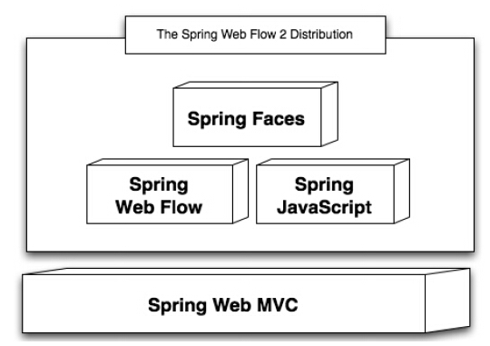
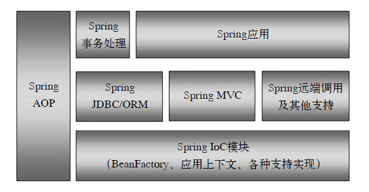

## Spring 整体架构及设计理念

### Spring 的各个子项目

1）`Spring Framework(Core)`

Spring 项目的核心。其中包含了一系列 IOC容器的设计，提供了依赖反转模式的实现。同时还集成了 AOP 功能。另外，在 Core 中，还包含了其它 Spring 的基本模块，如 MVC、JDBC、事务处理的实现。

2）`Spring Web Flow`

原先的 Spring Web Flow 是一个建立在 Spring MVC 基础上的 Web 工作流引擎。随着其自身项目的发展，Web Flow 比原来更为丰富，Spring Web Flow 定义了一种特定的语言来描述工作流，同时高级的工作流控制引擎可以管理会话状态，支持 AJAX 来构建丰富的客户体验，并且提供对 JSF 的支持，下面是 Spring Web Flow 的架构图：

3）Spring BlazeDS Integration

这是一个提供 Spring 与 Adobe Flex 技术集成的模块。在 Spring BlazeDS 中，为 Flex 前端和后台的通信提供了和 Spring 开发模式一致的编程模型。

4）Spring Security

是广泛使用的基于 Spring 的认证和安全工具，就是先前在 Spring 社区中久负盛名的 Acegi 框架，Spring 的老用户对这个框架不陌生- 这是一个自发的由 Spring 爱好者发起的安全框架，其目标是为 Spring 应用提供安全服务，如：用户认证、授权等。

5）Spring Security OAuth

这个项目为 OAuth 在 Spring 的集成提供支持。OAuth 是一个第三方的模块，提供一个开放的协议的实现，通过这个协议，前端桌面应用可以对 web 应用进行简单而标准的安全调用。

6）Spring Dynamic Modules

可以让 Spring 应用运行在 OSGI 的平台上。通过使用 OSGI 平台，增加了应用在部署和运行时的灵活性。

7）Spring Batch

提供构建批处理应用和自动化操作的框架，这些应用的特点是不需要与用户交互，重复的操作量大，对于大容量的批量数据处理而言，这些操作往往要求较高的可靠性。

8）Spring Integration

体现了企业集成模式的具体实现，并为企业的数据集成提供解决方案。为企业数据集成提供了各种适配器，通过这些适配器来转换各种消息格式，并帮助 Spring 应用完成与企业应用系统的集成。

9）Spring AMQP

是为 Spring 应用更好的使用基于 AMQP（高级消息队列协议）的消息服务而开发的，是 Spring 应用中使用 AMQP 消息服务器变得更为简单。

10）Spring .NET

是 Spring 在 .NET 环境中的移植，.NET 开发人员通过它可以在 .NET 环境中使用 Spring 的 Ioc容器，以及 AOP 这些在 Java 开发中被大家熟知的特性。

11）Spring Android

为 Android 终端开发应用提供 Spring 的支持，它提供了一个再 Android 应用环境中工作，基于 Java 的 REST 客户端。

12）Spring Mobile

Spring Mobile 和 Spring Android 不同，它能使工作在 Spring 传统的服务器端完成。它是基于 Spring MVC 构建的，为移动终端的服务器应用开发提供支持。

13）Spring Social

是 Spring 框架的扩展，可以帮助 Spring 应用更方便的使用 SNS。

14）Spring Data

为 Spring 应用提供使用非关系型数据的能力。如数据存储在 Map-Reduce 中的分布式存储、云计算存储环境等。Spring 应用可以考虑使用 Spring Data 来操作这种类型的数据。

### Spring 的整体架构

1）Spring IoC

包含了最为基本的 IoC 容器 BeanFactory 的接口与实现，也就是说在 Spring 的核心包下，不仅定义了 IoC 容器的最基本接口 BeanFactory，也提供了一系列这个接口的实现，如 XmlBeanFactory 就是最基本的 BeanFactory。IoC 容器的外围提供了一些支持，包括 Resource 访问的抽象和定位等，这些都是 IoC 的基本内容。除了提供如 BeanFactory 那样最为基本的容器形态外，SPring 还设计了 IoC 容器的高级形态 ApplicationContext 应用上下文供用户使用，对于应用来说，是 IoC容器中更面向框架的使用方式，为了方便应用开发，像国际化的消息源和应用支持事件这些特性，也都在这个模块中配合 IoC 容器来实现，这些功能围绕 IoC 容器和应用上下文的实现，构成了整个 IoC 模块设计的主要内容。

2）Spring AOP

是 Spring 的核心模块，围绕着 AOP 的增强功能，Spring 集成了 AspectJ 作为 Aop 的一个特定实现，同时还在 JVM 动态代理/ CGLIB 的基础上，实现了一个 AOP 框架，作为 Spring 继承其他模块的工具，比如 TransactionProxyFactoryBean 声明式事务处理，就是通过 AOP 集成到 Spring 中的。

3）Spring MVC

对于大多数企业应用而言，Web 应用已经是一种普遍的软件发布方式，而在 Web 应用的设计中，MVC 模式已经被广泛使用了。在 Java 的社区中，也有很多类似的 MVC 框架可以选择。Spring MVC 就是这样一个模块，这个模块以 DispatcherServlet 为核心，实现了 MVC 模式，包括怎样与 Web 容器环境继承，Web 请求的拦截、分发、处理和 ModelAndView 数据的返回，以及如何集成各种 UI 视图展现和数据表现。

4）Spring JDBC/Spring ORM

在企业应用中，对以数据库为基础的数据的处理是企业应用的一个重要方面，而对于关系数据库的处理，Java 提供了 JDBC 来进行操作，但在实际的应用中，单纯使用 JDBC 方式还是有些繁琐，所以在 JDBC 规范的基础上，SPring 对 JDBC 做了一层封装，使通过 JDBC 完成对数据库的操作更加简洁。Spring 提供了 JdbcTemplate 作为模板类，封装了基本的数据库操作方法，如数据的查询、更新等。另外 Spring JDBC 还提供了 RDBMS 的操作对象，这些操作对象可以使应用以更面向对象的方法来使用 JDBC，比如可以使用 MappingSqlQuery 将数据库数据记录直接映射到对象集合，类似一个极为简单的 ORM 工具。除了通过SPring JDBC 对数据库进行操作外，Spring 还提供了许多对 ORM 工具的封装，这些封装包括了常用的 ORM 工具，如 Hibernate、ibatis等，可以让用户更方便的使用这些 ORM 工具，而不是替代这些工具，如 HibernateTemplate。

5）Spring 事务处理

是一个通过 Spring AOP 实现自身功能增强的典型模块。在这个模块中，Spring 把企业应用开发中的事务处理的主要过程抽象过来，并且简洁的通过 AOP 的切面增强实现了声明式事务处理的功能。这个声明式处理的实现，使应用只需要在 IoC 容器中对事务属性进行配置即可完成，同时，这些事务处理的基本过程和具体的事务处理器实现是无关的，也就是说，应用可以选择不同的具体的事务处理机制，如 JIA、JDBC、Hibernate等。

6）Spring 远端调用

Spring 为应用带来的一个好处就是能够将应用解耦。应用解耦，一方面可以降低设计的复杂性，另一方面，可以在解耦以后将应用模块饭不是的部署，从而提高系统整体的性能。这种远程调用是通过 Spring 的封装从 Spring 应用到 Spring 应用之间的封装，为应用屏蔽了各种通信和调用细节的实现，同时，通过这一层的封装，使应用可以通过选择各种不同的远端调用来实现，比如可以使用 HTTP 调用器，可使用第三方二进制通信实现，甚至还封装了Java 技术中的 RMI 调用。

7）Spring 应用

从严格意义上来说，这个模块不属于 Spring 的范围，这部分的应用支持，往往来自一些使用的非常广泛的 Spring 子项目。或者改子项目本身就可以看成是一个独立的 Spring 应用，比如 Spring 处理安全问题的 Spring Acegi 后来转化为 Spring 的子项目。