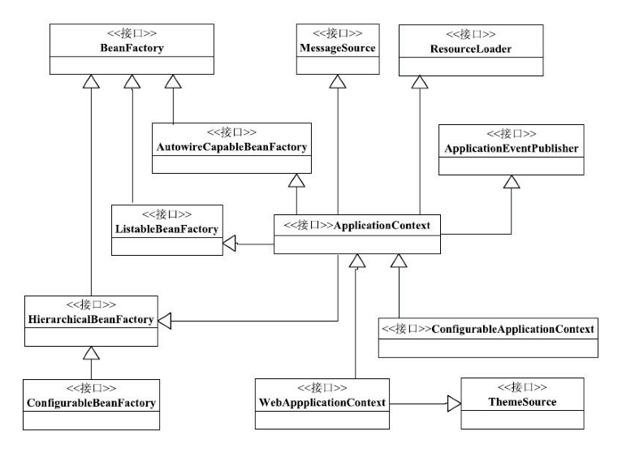

本文摘自书籍 [《Spring技术内幕：深入解析Spring架构与设计原理（第2版）》](https://www.amazon.cn/dp/B0077K9ZXY/ref=sr_1_1?s=books&ie=UTF8&qid=1533693228&sr=1-1&keywords=Spring+%E6%8A%80%E6%9C%AF%E5%86%85%E5%B9%95)

## Spring 核心：IoC

### Spring IoC 容器概述

#### IoC 容器和依赖反转模式

依赖对象的获得被反转称为控制反转，另一个更好的名字：依赖注入。

在面向对象系统中，对象封装了数据和对数据的处理，对象的依赖关系常常体现在对数据和方法的依赖上。这些依赖关系可以通过把对象的依赖注入交给框架或 IoC 容器来完成，这种从具体对象手中交出控制的做法是非常有价值的，他可以在解耦代码的同时提高代码的可测试性。

依赖控制反转的实现有很多种方式。在 Spring 中，IoC 容器是实现这个模式的载体，它可以在对象生成或初始化时直接将数据注入到对象中，也可以通过将对象引用注入到对象数据域中的方式来注入对方法调用的依赖。这种依赖注入是可以递归的，对象被逐层注入。

通过使用 IoC 容器，对象依赖关系的管理被反转了，转到 IoC 容器中，对象之间的相互依赖关系由 IoC 容器进行管理，并由 IoC 容器完成对象的注入。

对对象进行分类会发现除了一部分数据对象外，其它很大一部分对象是用来处理数据的，这些对象并不常发生变化，是系统中基础的部分。在很多情况下，这些对象在系统中以单件的形式起作用就可以满足应用的需求，而且他们也不常涉及数据和状态共享的问题。

#### Spring IoC 的应用场景

控制反转是解耦组件之间复杂关系的利器，Spring IoC 模块就是这个模式的一种实现。Spring IoC 提供了一个基本的 JavaBean 容器，通过 IoC 模式管理依赖关系，并通过依赖注入和AOP 增强了为 JavaBean 这样的 POJO 对象赋予事务管理、声明周期管理等基本功能。

在设计组件时，往往需要引用和调用其他组件的服务，这种依赖关系如果固化在组件在中，就会造成依赖关系的僵化和维护难度的增加，这个时候，如果使用 IoC 容器，把资源获取的方向反转，让 IoC 容器主动管理这些依赖关系，将这些依赖关系注入到组件中，那么会让这些依赖关系的适配和管理更加灵活。


### BeanFactory 、ApplicationContext

在 Spring IoC 中可以看到两个主要的容器系列：

1）BeanFactory - 实现自此接口的简单容器，仅实现了容器的最基本功能。

2）ApplicationContext - 应用上下文，作为容器的高级形态而存在。在简单容器的基础上增加了许多面向框架的特性，同时对应用环境做了许多适配。

在Spring 中有很多容器实现，但这些容器实现都有一个基类 - BeanFactory，BeanFactory 定义了容器的基本功能，只有实现此接口的功能的才能称之为容器，而 ApplicationContext 就是实现 BeanFactory的基础上的一个扩展。

在 Spring 中，通过定义 BeanDefinition 来管理基于 Spring 的应用中的各种对象以及他们之间的相互依赖关系。BeanDefinition 抽象了 bean 的定义，是让容器起作用的主要数据类型。IoC 容器是管理对象依赖关系的，对 IoC 容器来说，BeanDefinition 就是对依赖反转模式中管理的对象依赖关系的数据抽象，也是容器实现依赖注入功能的核心数据结构。

#### Spring IoC 容器的设计



1）BeanFactory -> HierarchicalBeanFactory -> ConfigurableBeanFactory，这是一条主要的 BeanFactory 设计路径，BeanFactory 接口定义了基本的 IoC 容器的规范。在这个接口定义中，包括了 getBean() 这样的 IoC 容器的基本方法。而 HierarchicalBeanFactory 接口继承了 BeanFactory 的基本接口之后增加了 getParentBeanFactory() 的接口功能，使 BeanFactory 具备了 双亲 IoC 容器的管理功能。在接下来的 ConfigurableBeanFactory 接口中，主要定义了一些对 BeanFactory 的配置功能，比如通过 setParentBeanFactory() 设置双亲 IoC 容器，通过 addBeanPostProcessor() 配置 Bean 后置处理器等。通过这些接口的功能的叠加，定义了 BeanFactory 就是简单 IoC 容器的基本功能。


2）第二条主线是以 ApplicationContext 应用上下文接口为核心的接口设计，这里涉及的主要接口设计有：从 BeanFactory  -> ListableBeanFactory -> ApplicationContext -> WebApplicationContext | ConfigurableApplicationContext。常用的应用上下文基本上都是 ConfigurableApplicationContext 或者 WebApplicationContext 的实现。在这个接口体系中，ListableBeanFactory 和 HierarchicalBeanFactory 两个接口，连接 BeanFactory 接口定义和 ApplicationContext 应用上下文的接口定义。在 ListableBeanFactory 接口中，细化了许多 BeanFactory 的接口功能，比如定义了 getBeanDefinitionNames() 接口方法。对于 ApplicationContext 接口，它通过集成 MessageSource、ResourceLoader、ApplicationEventPublisher 接口，在 BeanFactory 简单容器的基础上添加了许多对高级容器的特性支持。


3）简单容器实现类 - DefaultListableBeanFactory，实现了 ConfigurableBeanFactory，从而成为一个简单 IoC 容器的实现。其它如 XmlBeanFactory 容器都是在 DefaultListableBeanFactory 的基础上做扩展，ApplicationContext 的实现也是如此。


1、BeanFactory

BeanFactory 提供的是最基本的 IoC 容器的功能，定义了 IoC 容器最基本的形式，并且提供了 IoC 容器所应该遵守的最底层和最基本的编程规范，这些接口定义勾画了 IoC 的基本轮廓。

```java
// 1. 通过指定 bean name 获取 bean
// 2. 若通过 &bean name 获取，则返回 FactoryBean
Object getBean(String name) throws BeansException;

// 通过bean name，及bean 类型获取 bean
<T> T getBean(String name, @Nullable Class<T> requiredType) throws BeansException;

// 若想获取一个原型对象，可使用此方法，传入bean name 及对应构造函数的参数
Object getBean(String name, Object... args) throws BeansException;

// 获取指定类型的 bean
<T> T getBean(Class<T> requiredType) throws BeansException;

// 同上，但获取的原型对象，同时制定了构造函数的参数
<T> T getBean(Class<T> requiredType, Object... args) throws BeansException;

// 判断容器是否存在此名称的 bean
boolean containsBean(String name);

// 指定 bean name 的 bean 是否为单例类型
boolean isSingleton(String name) throws NoSuchBeanDefinitionException;

// 是否为原型类型
boolean isPrototype(String name) throws NoSuchBeanDefinitionException;

// 检查指定 name 的 bean 的 class 是否为特定类型
boolean isTypeMatch(String name, ResolvableType typeToMatch) throws NoSuchBeanDefinitionException;

// 检查指定 name 的 bean 的 class 是否为特定类型
boolean isTypeMatch(String name, @Nullable Class<?> typeToMatch) throws NoSuchBeanDefinitionException;

// 获取 bean class 类型
Class<?> getType(String name) throws NoSuchBeanDefinitionException;

// 查询 bean 的所有别名
String[] getAliases(String name);
```

2、BeanFactory 容器设计原理

和上下文相比，它只提供基本的 IoC 容器的功能。DefaultListableBeanFactory 包含了基本 IoC容器的所有功能，实际上把它作为一个默认的功能完整的 IoC 容器来使用的。

```java
public static DefaultListableBeanFactory build(String classpathFileName) {
    
    DefaultListableBeanFactory factory = new DefaultListableBeanFactory();

    XmlBeanDefinitionReader reader = new XmlBeanDefinitionReader(factory);

    reader.loadBeanDefinitions(new ClassPathResource(classpathFileName));

    return factory;
}
```

使用：

1）创建 IoC 配置文件的抽象资源，这个抽象资源包含了 BeanDefinition的定义信息。

2）创建一个 BeanFactory，这里使用 DefaultListableBeanFactory。

3）创建一个载入 BeanDefinition 的读取器，这里使用 XMLBeanDefinitionReader 来载入 XML 文件形式的 BeanDefinition，通过一个回调配置给 BeanFactory。

4）从定义好的资源位置读入配置信息，具体的解析过程有 XMLBeanDefinitionReader 来完成。完成整个载入和注册 Bean 定义之后，需要的 IoC 容器就建立起来了。


3、ApplicationContext 的应用场景

相比简单拓展 BeanFactory 的基本 IoC 容器，开发人员常用的 ApplicationContext 除了能够提供前面介绍的基本功能外，还为用户提供了以下的附加服务，可以让客户更方便的使用：

1）支持不同的信息源，因为 ApplicationContext 拓展了 MessageSource 接口，这些信息源的扩展功能可以支持国际化的实现，为开发多语言版本的应用提供服务。

2）访问资源，体现在对 ResourceLoader和Resource的支持上，这样我们可以从不同地方得到 Bean 定义资源。一般实现了 ApplicationContext 的 IoC 容器都继承了 DefaultResourceLoader 抽象类。

3）支持应用事件，继承了接口 ApplicationEventPublisher，从而在上下文中引入了事件机制。这些事件和 Bean 的生命周期的结合为 Bean 的管理提供了便利。

4）在 ApplicationContext 中提供的附加服务，这些服务使得基本 IoC 容器的功能更丰富。因为具备了这些丰富的附加功能，使得 ApplicationContext 与简单的 BeanFactory 相比，对它的使用是一种面向框架的使用风格，所以一般建议在开发应用中使用 ApplicationContext 作为 IoC 容器的基本形式。


4、ApplicationContext 容器的设计原理

在 ApplicationContext 容器中，我们以常用的 FileSystemXMLApplicationContext 的实现为例。在 FileSystemXMLApplicationContext 的设计中，可以发现ApplicationContext 的主要功能已经在 AbstractXMLApplicationContext 中实现了，在 FileSystemXMLApplicationContext  中，只需要实现自身设计相关的两个功能：

1）若应用直接使用 FileSystemXMLApplicationContext，对于实例化这个应用上下文的支持，同时启动 IoC 容器 的 refresh 过程。这在 FileSystemXMLApplicationContext  的代码实现可以看到：

```java
public FileSystemXmlApplicationContext(
			String[] configLocations, boolean refresh, @Nullable ApplicationContext parent)
			throws BeansException {

    super(parent);
    setConfigLocations(configLocations);
    if (refresh) {
        refresh();
    }
}
```

这个 refresh 过程会牵涉 IoC 容器启动的一系列复杂操作，同时，对于不同容器实现，这些操作都是类似的，因此在基类中将他们封装好。所以，我们在 FileSystemXmlApplicationContext 的设计中看到的只是一个简单的调用。

2）读取以 XML 形式存在的 BeanDefinition。

```java
protected Resource getResourceByPath(String path) {
    if (path.startsWith("/")) {
        path = path.substring(1);
    }
    return new FileSystemResource(path);
}
```

可以得到 FileSystemResource 的资源定位。


### IoC 容器的初始化过程

简单地说，IoC 容器的初始化是由 refresh 方法来启动的，这个方法标志着 IoC 容器正式启动。具体来说，这个启动包括 BeanDefinition 的 Resource 定位、载入和注册三个基本过程。这三个过程被 Spring 分开由不同的模块完成：resourceLoader、BeanDefinitionReader等。

1）第一个过程：Resource 的定位过程，这个 Resource 定位指的是 BeanDefinition 的资源定位，它由 ResourceLoader 通过统一的 Resource 接口来完成，这个 Resource 对各种形式的 BeanDefinition 的使用都提供了统一接口。

2）第二个过程：BeanDefinition 的载入，这个载入过程是把用户定义好的 Bean 表示成 IoC 容器内部的数据结构，而这个容器内部的数据结构就是 BeanDefinition。BeanDefinition 实际上就是 POJO 在 IoC 容器中的抽象，通过这个 BeanDefinition 定义的数据结构，使 IoC 容器能够方便的对 POJO 对象也就是 Bean 进行管理。

3）第三个过程：向 IoC 容器注册这些 BeanDefinition的过程，这个过程是通过调用 BeanDefinitionRegistry 接口的实现来完成的。这个注册过程把载入过程中解析得到的 BeanDefinition 向 IoC 容器内部将 BeanDefinition 注入到一个 HashMap 中去，IoC 容器就是通过这个HashMap 来支持这些 BeanDefinition 数据的。

Spring 将 IOC 容器初始化过程与依赖注入分为两个独立的过程，依赖注入一般发生在应用第一次通过 getBean 想容器索取 Bean 的时候，但有一个例外就是 bean 配置定义了 lazyinit 属性，此时这个 Bean 的依赖注入在 IoC 容器初始化时就预先完成了，而不需要等待整个初始化完成以后，第一次使用 getBean 才触发。

#### BeanDefinition 的载入和解析

IoC 容器对 Bean 的管理和依赖注入功能的实现，是通过对其持有的 BeanDefinition 进行各种相关操作来完成的。这些 BeanDefinition 数据在 IoC 容器中通过一个 HashMap 来保持和维护。

```java
public void refresh() throws BeansException, IllegalStateException {
    synchronized (this.startupShutdownMonitor) {
        // 为上下文刷新做准备，包含 Environment 的创建及环境相关的 properties 的初始化及验证
        //  
        prepareRefresh();

        // 刷新内部的 bean factory （存在 bean factory 则销毁再创建）
        // 刷新过程中还包含对 BeanDefinition 的载入
        ConfigurableListableBeanFactory beanFactory = obtainFreshBeanFactory();

        // 对BeanFactory进行一些配置，包含上下文的类加载器、表达式解析器，忽略一些依赖的接口等
        prepareBeanFactory(beanFactory);

        try {
            // 配置 BeanFactory 的后置处理
            postProcessBeanFactory(beanFactory);

            // 调用 BeanFactory 的后处理器，这些后处理器是在 Bean 定义中向容器注册的
            invokeBeanFactoryPostProcessors(beanFactory);

            // 注册 bean 的后处理器，在 Bean 创建过程中调用。
            registerBeanPostProcessors(beanFactory);

            // 上下文的消息源进行初始化
            initMessageSource();

            // 初始化上下文的事件机制
            initApplicationEventMulticaster();

            // 初始化其它特殊 bean.
            onRefresh();

            // 检测监听 bean 并向容器注册这些 bean
            registerListeners();

            // 实例化所有需要直接初始化的单例 bean
            // init-lazy=false
            finishBeanFactoryInitialization(beanFactory);

            // 发布容器时间，结束 refresh 过程
            finishRefresh();
        }

        catch (BeansException ex) {
            if (logger.isWarnEnabled()) {
                logger.warn("Exception encountered during context initialization - " +
                            "cancelling refresh attempt: " + ex);
            }

            // 为防止 bean 资源占用，在异常处理中，销毁已经在前面过程中生成的单例 bean
            destroyBeans();

            // 重置 active 标志
            cancelRefresh(ex);

            throw ex;
        }
        finally {
            // Reset common introspection caches in Spring's core, since we
            // might not ever need metadata for singleton beans anymore...
            resetCommonCaches();
        }
    }
}
```

registerBeanDefinition 方法进行解析并转化为容器内部数据结构，BeanDefinition 的载入包括两部分，首先是通过调用 XML 的解析器得到 document 对象，但这些 document 对象并没有按照 Spring 的 Bean 规则进行解析。在完成通用的 XML 解析过后，才是按照 Spring 的 Bean 规则进行解析的地方，按照Spring 的 Bean 规则进行解析的过程是在 documentReader 中实现的，处理过后再完成 BeanDefinition 的处理，处理结果由 BeanDefinitionHolder 对象持有。这个 BeanDefinitionHolder 除了持有 BeanDefinition 对象外，还持有了其它与 BeanDefinition 的使用相关的信息，比如 Bean 的名字、别名集合等。而具体的解析在 BeanDefinitionParserDelegate 中完成。这个类包含了 Bean 定义规则的处理。对于其它元素配置的解析，会由parseBeanDefinitionElement 来完成。

#### BeanDefinition 在容器中的注册

前面已经解析的 BeanDefinition 此时还不能直接被 IOC 容器使用，需要在 IOC 容器中对这些 BeanDefinition 进行注册。这个注册为 IOC 容器提供更友好的使用方式。在 DefaultListableBeanFactory 中实现了 BeanDefinitionRegistry 的接口，这个接口的实现完成 BeanDefinition 向容器的注册。注册就是把 BeanDefinition 设置到 Map 中去。需要注意的是，如果遇见同名的 BeanDefinition 的情况，进行处理的时候需要依据 allowBeanDefinitionOverriding 的配置来完成，若存在相同名字的 BeanDefinition，再检查是否允许覆盖，若不允许则抛出异常。

完成了 BeanDefinition 的注册，就完成了 IOC 容器的初始化过程，此时，在我们使用的 IOC 容器 中已经建立了整个 Bean 的配置信息，而且这些 BeanDefinition已经可以被容器使用。容器的作用就是对这些信息进行处理和维护。这些信息是容器建立依赖注入的基础。

### 依赖注入

依赖注入的发生其实就是当需要一个 Bean 时发生的，若需要的 bean 存在依赖，那么就会触发依赖注入，完成后IOC 会返回一个已经注入的 Bean。在 Bean 的创建和对象依赖注入的过程中，需要根据 BeanDefinition 中的信息来递归的完成依赖注入。从 getBean 为入口，从上下文中查找需要的 Bean 和创建 bean 的递归调用，另一个递归是依赖注入时，通过递归调用容器的 getBean 方法，得到当前 Bean 依赖的 Bean，同时也触发对依赖 Bean 的创建和注入。在 Bean 创建和依赖注入完成之后，在 IoC 容器中建立起一系列依靠依赖关系联系起来的 Bean，这个 Bean 已经不是简单的 Java 对象了。该 Bean 系列以及 Bean 之间的依赖关系建立完成之后，通过 IoC 容器的相关接口方法，就可以非常方便的供上层应用使用了。


### 容器其它特性

#### ApplicationContext 和 Bean 的初始化及销毁

对 BeanFactory，特别是 ApplicationContext，容器自身也有一个初始化和销毁关闭的过程。在分析 Bean 初始化和销毁之前，需要介绍一下 IoC 容器中的 Bean 声明周期：

1）Bean 实例的创建

2）为 Bean 实例设置属性

3）调用 Bean 的初始化方法

4）应用可以通过 IoC 容器使用 Bean

5）当容器关闭时，调用 Bean 销毁方法

Bean 的初始化方法调用如下：

```java
protected Object initializeBean(final String beanName, final Object bean, @Nullable RootBeanDefinition mbd) {
    if (System.getSecurityManager() != null) {
        AccessController.doPrivileged((PrivilegedAction<Object>) () -> {
            invokeAwareMethods(beanName, bean);
            return null;
        }, getAccessControlContext());
    }
    else {
        invokeAwareMethods(beanName, bean);
    }

    Object wrappedBean = bean;
    if (mbd == null || !mbd.isSynthetic()) {
        wrappedBean = applyBeanPostProcessorsBeforeInitialization(wrappedBean, beanName);
    }

    try {
        invokeInitMethods(beanName, wrappedBean, mbd);
    }
    catch (Throwable ex) {
        throw new BeanCreationException(
            (mbd != null ? mbd.getResourceDescription() : null),
            beanName, "Invocation of init method failed", ex);
    }
    if (mbd == null || !mbd.isSynthetic()) {
        wrappedBean = applyBeanPostProcessorsAfterInitialization(wrappedBean, beanName);
    }

    return wrappedBean;
}

private void invokeAwareMethods(final String beanName, final Object bean) {
    if (bean instanceof Aware) {
        if (bean instanceof BeanNameAware) {
            ((BeanNameAware) bean).setBeanName(beanName);
        }
        if (bean instanceof BeanClassLoaderAware) {
            ClassLoader bcl = getBeanClassLoader();
            if (bcl != null) {
                ((BeanClassLoaderAware) bean).setBeanClassLoader(bcl);
            }
        }
        if (bean instanceof BeanFactoryAware) {
            ((BeanFactoryAware) bean).setBeanFactory(AbstractAutowireCapableBeanFactory.this);
        }
    }
}
```

在 bean 的初始化之前，会调用一系列的 Aware 接口实现，把相关的信息注入到 Bean 中去。接着会调用 invokeInitMethods 方法：

```java
protected void invokeInitMethods(String beanName, final Object bean, @Nullable RootBeanDefinition mbd) throws Throwable {

    boolean isInitializingBean = (bean instanceof InitializingBean);
    if (isInitializingBean && (mbd == null ||
             !mbd.isExternallyManagedInitMethod("afterPropertiesSet"))) {
        
        if (logger.isDebugEnabled()) {
            logger.debug("Invoking afterPropertiesSet() on bean with name '" + beanName + "'");
        }
        if (System.getSecurityManager() != null) {
            try {
                AccessController.doPrivileged((PrivilegedExceptionAction<Object>) () -> {
                    ((InitializingBean) bean).afterPropertiesSet();
                    return null;
                }, getAccessControlContext());
            }
            catch (PrivilegedActionException pae) {
                throw pae.getException();
            }
        }
        else {
            ((InitializingBean) bean).afterPropertiesSet();
        }
    }

    if (mbd != null && bean.getClass() != NullBean.class) {
        String initMethodName = mbd.getInitMethodName();
        if (StringUtils.hasLength(initMethodName) &&
            !(isInitializingBean && "afterPropertiesSet".equals(initMethodName)) &&
            !mbd.isExternallyManagedInitMethod(initMethodName)) {
            invokeCustomInitMethod(beanName, bean, mbd);
        }
    }
}
```

而 Bean 的销毁与初始化类似：

```java
protected void doClose() {
    if (this.active.get() && this.closed.compareAndSet(false, true)) {
        if (logger.isInfoEnabled()) {
            logger.info("Closing " + this);
        }

        LiveBeansView.unregisterApplicationContext(this);

        try {
            // Publish shutdown event.
            publishEvent(new ContextClosedEvent(this));
        }
        catch (Throwable ex) {
            logger.warn("Exception thrown from ApplicationListener handling ContextClosedEvent", ex);
        }

        // Stop all Lifecycle beans, to avoid delays during individual destruction.
        if (this.lifecycleProcessor != null) {
            try {
                this.lifecycleProcessor.onClose();
            }
            catch (Throwable ex) {
                logger.warn("Exception thrown from LifecycleProcessor on context close", ex);
            }
        }

        // Destroy all cached singletons in the context's BeanFactory.
        destroyBeans();

        // Close the state of this context itself.
        closeBeanFactory();

        // Let subclasses do some final clean-up if they wish...
        onClose();

        this.active.set(false);
    }
}
```

其中调用 destroy 方法，对 Bean 进行销毁处理

```java
public void destroy() {
    if (!CollectionUtils.isEmpty(this.beanPostProcessors)) {
        for (DestructionAwareBeanPostProcessor processor : this.beanPostProcessors) {
            processor.postProcessBeforeDestruction(this.bean, this.beanName);
        }
    }

    if (this.invokeDisposableBean) {
        if (logger.isDebugEnabled()) {
            logger.debug("Invoking destroy() on bean with name '" + this.beanName + "'");
        }
        try {
            if (System.getSecurityManager() != null) {
                AccessController.doPrivileged((PrivilegedExceptionAction<Object>) () -> {
                    ((DisposableBean) bean).destroy();
                    return null;
                }, acc);
            }
            else {
                ((DisposableBean) bean).destroy();
            }
        }
        catch (Throwable ex) {
            String msg = "Invocation of destroy method failed on bean with name '" + this.beanName + "'";
            if (logger.isDebugEnabled()) {
                logger.warn(msg, ex);
            }
            else {
                logger.warn(msg + ": " + ex);
            }
        }
    }

    if (this.destroyMethod != null) {
        invokeCustomDestroyMethod(this.destroyMethod);
    }
    else if (this.destroyMethodName != null) {
        Method methodToCall = determineDestroyMethod(this.destroyMethodName);
        if (methodToCall != null) {
            invokeCustomDestroyMethod(methodToCall);
        }
    }
}
```

#### FactoryBean 

FactoryBean 为应用生成需要的对象，这些对象往往是经过特殊处理的，如 ProxyFactoryBean 这样的特殊 Bean。这种 FactoryBean 的机制可以为我们提供一个很好的封装机制，比如封装 Proxy、RMI、JNDI等。


#### BeanPostProcessor

BeanPostProcessor 是使用 IoC 容器时经常会遇到的一个特性，这个 Bean 的后置处理器是一个监听器，它可以监听触发的事件。将它向 IoC 容器注册后，容器中管理的 Bean 具备了接收 IoC 容器事件回调的能力。使用 BeanPostProcessor 很简单，首先实现接口 BeanPostProcessor ：

```java
class InstanceProcessor implements BeanPostProcessor {
    @Override
    public Object postProcessBeforeInitialization(Object bean, String beanName) throws BeansException {
        return null;
    }

    @Override
    public Object postProcessAfterInitialization(Object bean, String beanName) throws BeansException {
        return null;
    }
}
```

实现后通过 XML 配置到 Bean 中去即可。前一个方法会在 Bean 的初始化前调用，后一个方法会在 Bean 初始化后进行调用。


#### autowiring

IoC 自动依赖装配的方式，为应用使用容器提供更大的方便，不需对Bean属性做显式的依赖关系声明，只需要配置好 autowiring 属性，IoC 容器会根据这个属性的而配置，使用反射自动找到属性的类型或者名字，然后基于属性的类型或名字来自动匹配 IoC 容器中的 Bean，从而自动完成依赖注入。


#### bean 的依赖检查

在 Bean 中配置 dependency-check 属性来指定依赖检查模式，包括：`none`、`simple`、`object`、`all`。


#### Bean 对 IoC 容器的感知

bean 可以实现 aware 接口来获取这些对象：

1）BeanNameAware，可以在 Bean 中得到在 IOC 容器中的 Bean name。

2）BeanFactoryAware，可以在 Bean 中得到 Bean 所在的IoC 容器。

3）ApplicationContextAware，得到 Bean 所在的应用上下文。

4）MessageSourceAware，得到消息源。

5）ApplicationEventPublisherAware，得到应用上下文的事件发布器，从而可以在 Bean 中发布应用上下文的事件。

6）ResourceLoaderAware，得到ResourceLoader，从而在 Bean 中使用 ResourceLoader 加载外部对应的 Resource 资源。

在bean 初始化过程中会对这些资源进行注入。

