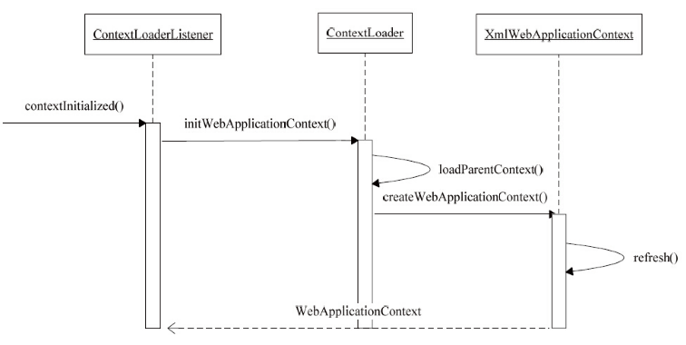

## Spring MVC

MVC 模式：

分离了模型、视图、控制器三汇总角色，将业务处理从 UI 设计中独立出来，封装到模型和控制器设计中去，使得他们之间解耦，可以独立扩展而不需彼此依赖。

### Web 环境中的 Spring MVC

MVC 是建立在 IoC 容器基础上的，而 Spring IoC 是一个独立的模块，如果要在 Web 环境中使用 IoC 容器，需要 Spring 为 IoC 设计一个启动过程，把IoC 容器导入，并在 Web 容器中建立起来。这个启动过程和 Web 容器的启动过程集成在一起的，在这个过程中，一方面处理 Web 容器的启动，另一方面通过设计特定的 Web 容器拦截器，将 IoC 容器载入到 Web 环境中来，并将其初始化。

在 Tomcat 中，需要配置对应的 Web.xml 文件：

```xml
<servlet>
  	<servlet-name>dispatcher</servlet-name>
  	<servlet-class>org.springframework.web.servlet.DispatcherServlet</servlet-class>
</servlet>

<servlet-mapping>
    <servlet-name>dispatcher</servlet-name>
    <url-pattern>/</url-pattern>
</servlet-mapping>

<context-param>
    <param-name>contextConfigLocation</param-name>
    <param-value>/WEB-INF/dispatcher-servlet.xml</param-value>
</context-param>

<listener>
    <listener-class>org.springframework.web.context.ContextLoaderListener</listener-class>
</listener>
```

首先定义一个 Servlet对象，它是 Spring MVC 的 DispatcherServlet。这个 DispatcherServlet 是 MVC 中很重要的一个类，起着分发请求的作用。可配置 context-param 参数来指定 Spring IoC 容器读取 Bean 定义的 XML 文件的路径。最后配置一个监听器，ContextLoaderListener，负责完成 IoC 容器在Web 容器环境中的启动工作。

DispatcherServlet 和 ContextLoaderListener 提供了在 Web 容器中对 Spring 的接口，也就是说哦，这些接口与 Web 容器耦合是通过 ServletContext 来实现的。这个 ServletContext 为 Spring 的 IoC 容器提供了一个宿主环境，在宿主环境中，Spring MVC 建立起一个IoC 容器体系。这个容器体系是通过 ContextLoaderListener 的初始化建立起来的，在建立 IoC 容器体系后，把 DispatcherServlet 作为 Spring MVC 处理 Web 请求的转发器建立起来，从而完成响应 HTTP 请求的准备。

### 上下文在 Web 容器中的启动

#### IoC 容器启动的基本过程

IoC 容器的启动过程就是建立上下文的过程，该上下文是与 ServletContext 相伴而生的，同时也是 IoC 容器在 Web 应用环境中的具体表现之一。由 ContextLoaderListener 启动的上下文是根上下文。在根上下文的基础上，还有一个与 WebMVC 相关的上下文用来保存控制器需要的 MVC 对象，作为根上下文的自上下文，构成一个层次化的上下文体系。在 Web 容器中启动 Spring 应用程序时，首先建立根上下文，然后建立这个上下文体系的，这个上下文体系的建立是由 ContextLoader 来完成的。



在 web.xml 中，已经配置了 ContextLoaderListener，这个 ContextLoaderListener 是 Spring 提供的类，是为在 Web 容器中建立 IoC 容器服务的，它实现了 ServletContextListener 接口。这个接口是在 Servlet API 中定义的，提供了 与 Servlet 声明周期结合的回调，比如 contextInitialized 方法和 contextDestroyed 方法。而在web容器中，建立 WebApplicationContext 的过程，是在的接口实现中完成的。具体的载入 IoC 容器的过程是由 ContextLoaderListener 交由 ContextLoader 来完成的，而 ContextLoader 本身就是 ContextLoaderListener 的基类。

在 ContextLoader 中，完成了两个 IoC 容器建立的基本过程，一个是 Web 容器中建立起双亲 IoC 容器，另一个是生成响应的 WebApplicationContext 并将其初始化。


#### Web 容器中的上下文设计


下面是 WebApplication 的接口方法，它定义了 getServletContext 方法，通过这个方法可以得到当前 Web 容器的 Servlet 上下文环境，通过这个方法，相当于提供了一个 Web 容器级别的全局环境。


在启动过程中，Spring 会使用一个默认的 WebApplicationContext 实现作为 IoC 容器。这个默认使用的 IoC 容器就是 XmlWebApplicationContext，XMLWebApplicationContext 是从 ApplicationContext 继承下来的，在基本的 ApplicationContext功能的基础上，增加了对 Web 环境和 XML配置定义的处理。在 XmlWebApplicationContext 的初始化过程中，web容器中的 IoC 容器被建立起来，从而在 Web 容器中建立起整个 Spring 应用。

```java
// 执行 refresh 的过程中会调用此方法
protected void loadBeanDefinitions(DefaultListableBeanFactory beanFactory) 
                                                 throws BeansException, IOException {
    // Create a new XmlBeanDefinitionReader for the given BeanFactory.
    XmlBeanDefinitionReader beanDefinitionReader = new XmlBeanDefinitionReader(beanFactory);

    // Configure the bean definition reader with this context's
    // resource loading environment.
    beanDefinitionReader.setEnvironment(getEnvironment());
    beanDefinitionReader.setResourceLoader(this);
    beanDefinitionReader.setEntityResolver(new ResourceEntityResolver(this));

    // Allow a subclass to provide custom initialization of the reader,
    // then proceed with actually loading the bean definitions.
    initBeanDefinitionReader(beanDefinitionReader);
    loadBeanDefinitions(beanDefinitionReader);
}
```

从代码中可以看到 XMLWebApplicationContext 中，基本的实现都已经通过继承获得，这里处理的就是如何获取 Bean 定义信息，即如何获取 WEBINF 下的配置文件信息，获取这些信息后的处理都是一样的。


#### ContextLoader 的设计与实现

对于 Spring 承载的 Web 应用而言，可以指定在 Web 应用程序启动时载入 IoC 容器。这个功能是由 ContextLoaderListener 这样的类完成的，它是在 Web 容器中配置的监听器。这个 ContextLoaderListener 通过使用 ContextLoader 来完成实际的 WebApplicationContext，也就是 IoC 容器的初始化工作。这个 ContextLoader 就像 Spring 应用程序在 Web 容器中的启动器，这个启动过程是 web 容器中发生的，所以需要根据 web 容器部署要求来定义 ContextLoader。

ContextLoaderListener 是启动 根容器并把它载入到 web 容器的主要功能模块，也是整个 Spring Web应用加载 IoC 的第一个地方。从加载过程可以看到，首先从 Servlet 事件中得到 ServletContext，然后可以读取配置在 web,xml 中的各个相关属性值，接着 ContextLoader 会实例化 WebApplicationContext，并完成其载入和初始化过程。这个初始化的第一个上下文作为根上下文而存在，这个根上下文载入后，被绑定到 web 应用程序的 ServletContext 上。任何需要访问根上下文的应用程序代码可以从 WebApplicationContextUtils 类的静态方法中得到。

```java
public static WebApplicationContext getWebApplicationContext(ServletContext sc
															, String attrName) {
    Assert.notNull(sc, "ServletContext must not be null");
    Object attr = sc.getAttribute(attrName);
    if (attr == null) {
        return null;
    }
    if (attr instanceof RuntimeException) {
        throw (RuntimeException) attr;
    }
    if (attr instanceof Error) {
        throw (Error) attr;
    }
    if (attr instanceof Exception) {
        throw new IllegalStateException((Exception) attr);
    }
    if (!(attr instanceof WebApplicationContext)) {
        throw new IllegalStateException("Context attribute is not of type WebApplicationContext: " + attr);
    }
    return (WebApplicationContext) attr;
}
```

在 ContextLoaderListener 中，实现的是 ServletContextListener 接口，这个接口里的函数结合 web 容器的声明周期被调用，因为 ServletContextListener 是 ServletContext 的监听者，如果 ServletContext 发生变化，会触发相应的事件，而监听器一直在对这些事件进行监听，如果接收到了监听的事件，就会做出预先设计好的响应动作。由于 ServletContext 的变化而触发的监听器的响应具体包括：在服务器启动时，ServletContext 被创建的时候；服务器关闭时，ServletContext 将被销毁的时候等。对应这些事件及 Web 容器状态的变化，在监听器中定义了对应的时间响应的回调方法。比如在服务器启动时，ServletContextListener 的 contextInitialized 方法将会被调用，服务器将要关闭时，ServletContextListener 的 contextDestroyed 方法将会被调用。

```java
public void contextInitialized(ServletContextEvent event) {
    initWebApplicationContext(event.getServletContext());
}

// ContextLoader#initWebApplicationContext(ServletContext servletContext)
public WebApplicationContext initWebApplicationContext(ServletContext servletContext) {
    // 判断根上下文是否已经存在
    if(servletContext.getAttribute(
        WebApplicationContext.ROOT_WEB_APPLICATION_CONTEXT_ATTRIBUTE) != null) {
        // 存在则抛出异常
        throw new IllegalStateException(
            "Cannot initialize context because there is already a root application context present - " +
            "check whether you have multiple ContextLoader* definitions in your web.xml!");
    }

    Log logger = LogFactory.getLog(ContextLoader.class);
    servletContext.log("Initializing Spring root WebApplicationContext");
    if (logger.isInfoEnabled()) {
        logger.info("Root WebApplicationContext: initialization started");
    }
    long startTime = System.currentTimeMillis();

    try {
        // Store context in local instance variable, to guarantee that
        // it is available on ServletContext shutdown.
        if (this.context == null) {
            this.context = createWebApplicationContext(servletContext);
        }
        if (this.context instanceof ConfigurableWebApplicationContext) {
            ConfigurableWebApplicationContext cwac 
                = (ConfigurableWebApplicationContext) this.context;
            if (!cwac.isActive()) {
                // The context has not yet been refreshed -> provide services such as
                // setting the parent context, setting the application context id, etc
                if (cwac.getParent() == null) {
                    // The context instance was injected without an explicit parent ->
                    // determine parent for root web application context, if any.
                    ApplicationContext parent = loadParentContext(servletContext);
                    cwac.setParent(parent);
                }
                configureAndRefreshWebApplicationContext(cwac, servletContext);
            }
        }
        servletContext
            .setAttribute(WebApplicationContext
                          .ROOT_WEB_APPLICATION_CONTEXT_ATTRIBUTE , this.context);

        ClassLoader ccl = Thread.currentThread().getContextClassLoader();
        if (ccl == ContextLoader.class.getClassLoader()) {
            currentContext = this.context;
        }
        else if (ccl != null) {
            currentContextPerThread.put(ccl, this.context);
        }

        if (logger.isDebugEnabled()) {
            logger.debug("Published root WebApplicationContext as ServletContext attribute with name [" +
                         WebApplicationContext.ROOT_WEB_APPLICATION_CONTEXT_ATTRIBUTE + "]");
        }
        if (logger.isInfoEnabled()) {
            long elapsedTime = System.currentTimeMillis() - startTime;
            logger.info("Root WebApplicationContext: initialization completed in " + elapsedTime + " ms");
        }

        return this.context;
    }
    catch (RuntimeException ex) {
        logger.error("Context initialization failed", ex);
        servletContext
            .setAttribute(WebApplicationContext
                          .ROOT_WEB_APPLICATION_CONTEXT_ATTRIBUTE, ex);
        throw ex;
    }
    catch (Error err) {
        logger.error("Context initialization failed", err);
        servletContext
            .setAttribute(WebApplicationContext
                          .ROOT_WEB_APPLICATION_CONTEXT_ATTRIBUTE, err);
        throw err;
    }
}
```

这里创建的根上下文是 web 容器中唯一的实例，如果在这个初始化过程中发现已经有根上下文被常见了，这里会抛出异常提示创建失败。创建成功后，会被存到 web 容器的 ServletContext 中，供需要时使用。

### Spring MVC 的设计与实现

#### Spring MVC 设计概览

在完成对 ContextLoaderListener 的初始化以后，web容器开始初始化 DispatcherServlet，这个初始化的启动与在 Web.xml 中对载入次序的定义有关。DispatcherServlet 会建立自己的上下文来持有 Spring MVC 的 Bean 对象，在建立这个自己持有的 IoC 容器时，会从 ServletContext 中得到根上下文作为 DispatcherServlet 持有上下文的双亲上下文。有了这个根上下文，在对自己持有的上下文进行初始化，最后把自己持有的这个上下文保存到 ServletContext 中，供以后检索和使用。


DispatcherServlet 通过集成 FrameworkServlet 和 HttpServletBean 而继承了 HTTPServlet，通过使用 Servlet API来对 HTTP 请求进行响应，成为 Spring MVC 的前端处理器，同时成为 MVC 模块与 Web 容器集成的处理前端。DispatcherServlet 的工作大致可分为两个部分：一个是初始化部分，由 initServletBean 启动，通过 initWebApplicationContext 方法最终调用 DispatcherServlet 的 initStrategies 方法，在这个方法里，DispatcherServlet 对 MVC 模块的其他部分进行了初始化，比如 handlerMapping、ViewResolver等。另一个是对 HTTP 请求进行响应，作为一个 Servlet。web 容器会调用 Servlet 的doget方法等。DispatcherServlet 还重写了 doService 方法，在这个方法调用中封装了 doDispatch 方法，此方法是实现 MVC 的主要部分。


#### DispatcherServlet 的启动和初始化

作为 Servlet，DispatcherServlet 的启动与 Servlet 的启动过程是相联系的，在 Servlet 的初始化过程中，Servlet 的init 方法会被调用，以进行初始化。DispatcherServlet 的基类 HttpServletBean 中的这个初始化过程：

```java
public final void init() throws ServletException {
    if (logger.isDebugEnabled()) {
        logger.debug("Initializing servlet '" + getServletName() + "'");
    }

    // Set bean properties from init parameters.
    PropertyValues pvs = new ServletConfigPropertyValues(getServletConfig(), this.requiredProperties);
    if (!pvs.isEmpty()) {
        try {
            BeanWrapper bw = PropertyAccessorFactory.forBeanPropertyAccess(this);
            ResourceLoader resourceLoader = new ServletContextResourceLoader(getServletContext());
            bw.registerCustomEditor(Resource.class, new ResourceEditor(resourceLoader, getEnvironment()));
            initBeanWrapper(bw);
            bw.setPropertyValues(pvs, true);
        }
        catch (BeansException ex) {
            if (logger.isErrorEnabled()) {
                logger.error("Failed to set bean properties on servlet '" + getServletName() + "'", ex);
            }
            throw ex;
        }
    }

    // Let subclasses do whatever initialization they like.
    initServletBean();

    if (logger.isDebugEnabled()) {
        logger.debug("Servlet '" + getServletName() + "' configured successfully");
    }
}
```

在初始化开始时，需要读取配置在 ServletContext 中的 Bean 属性参数，这些属性参数设置在 web.xml 的 web 容器初始化参数中，使用编程式的方式来设置这些 bean 属性，这里的依赖注入是与 web 容器初始化相关的。

接着会执行 DispatcherServlet 持有的 IoC 容器的初始化过程，在这个初始化过程中，一个新的上下文被建立起来，这个 DispatcherServlet 持有的上下文被设置为根上下文的子上下文，DispatcherServlet 持有的上下文是和 Servlet 对应的一个上下文。在一个 web 应用中，往往可以容纳多个 Servlet 存在。与此相对应，对于应用在 Web 容器中的上下文体系，一个根上下文可以作为许多 Servlet 上下文的双亲上下文。

建立 DispatcherServlet 的上下文，需要把跟上下文作为参数传递给它，然后使用反射技术来实例化上下文对象，并为它设置参数。根据默认的配置，这个上下文对象也是 XMLWebApplicationContext 对象，这个类型是在 DEFAULT_CONTEXT_CLASS 参数中设置好并允许 BeanUtils 使用的。在实例化结束以后，需要为这个上下文对象设置好一些基本的配置，这些配置包括它的双亲上下文、Bean 定义配置的文件位置等。完成这些配置以后，最后通过调用 IOC 容器的 refresh 方法来完成 IOC 容器的最终初始化。

此时 DispatcherServlet 中的 IOC 容器已经建立起来了，这个 IOC 容器是根上下文的子容器。这样的设置，使得具体的一个 Bean 定义查找过程来说，如果要查找一个 由 DispatcherServlet 所在容器来管理的 Bean，系统会首先到根上下文中去查找。如果查找不到，才会到 DispatcherServlet 所管理的 IOC 容器中进行查找，这是由 IOC 容器 getBean 的实现来决定的。

DispatcherServlet 持有一个以自己的 Servlet 名称命名的容器。这个容器是一个 WebApplicationContext 对象，这个 IOC 容器建立起来以后，意味着 DispatcherServlet 拥有自己的 bean 定义空间，这为使用各个独立的 XML 文件来配置 MVC 中各个 Bean 创造了条件。由于初始化结束以后，与 Web 容器相关的加载过程实际上已经完成了，Spring MVC 的具体实现和普通的 Spring 应用程序的实现并没有太大的区别。在 Spring MVC DispatcherServlet 的初始化过程中，以对 HandlerMapping 的初始化调用作为触发点，可以了解模块初始化的方法调用关系。

DispatcherServlet 的 initStrategies 方法，会启动 Spring MVC 框架的初始化。包括对各种 MVC 框架的实现元素，比如支持国际化的 LoadResolver、支持request 映射的 HandlerMapping以及视图生成的 ViewResolver等的初始化。

```java
protected void initStrategies(ApplicationContext context) {
    initMultipartResolver(context);
    initLocaleResolver(context);
    initThemeResolver(context);
    initHandlerMappings(context);
    initHandlerAdapters(context);
    initHandlerExceptionResolvers(context);
    initRequestToViewNameTranslator(context);
    initViewResolvers(context);
    initFlashMapManager(context);
}
```

以 HandlerMapping 为例，这里的 Mapping 关系的作用是，为 HTTP 请求找到相应的 Controller 控制器，从而利用这些控制器 Controller 去完成设计好的数据处理工作。HandlerMapping 完成对 MVC 中 Controller 的定义和配置，只不过在 Web 这个特定的应用环境中，这些控制器与具体的 HTTP 请求向对应。DispatcherServlet 中 HandlerMapping 初始化过程的具体实现如下：

```java
private void initHandlerMappings(ApplicationContext context) {
		this.handlerMappings = null;

		if (this.detectAllHandlerMappings) {
			// Find all HandlerMappings in the ApplicationContext, including ancestor contexts.
			Map<String, HandlerMapping> matchingBeans =
					BeanFactoryUtils.beansOfTypeIncludingAncestors(context, HandlerMapping.class, true, false);
			if (!matchingBeans.isEmpty()) {
				this.handlerMappings = new ArrayList<>(matchingBeans.values());
				// We keep HandlerMappings in sorted order.
				AnnotationAwareOrderComparator.sort(this.handlerMappings);
			}
		}
		else {
			try {
				HandlerMapping hm = context.getBean(HANDLER_MAPPING_BEAN_NAME, HandlerMapping.class);
				this.handlerMappings = Collections.singletonList(hm);
			}
			catch (NoSuchBeanDefinitionException ex) {
				// Ignore, we'll add a default HandlerMapping later.
			}
		}

		// Ensure we have at least one HandlerMapping, by registering
		// a default HandlerMapping if no other mappings are found.
		if (this.handlerMappings == null) {
			this.handlerMappings = getDefaultStrategies(context, HandlerMapping.class);
			if (logger.isDebugEnabled()) {
				logger.debug("No HandlerMappings found in servlet '" + getServletName() + "': using default");
			}
		}
	}
```

在 HandlerMapping 初始化过程中，把 Bean 配置文件中配置好的 HandlerMapping 从 IOC 容器中取得，经过读取后，HandlerMapping 变量就已经获取了在 BeanDefinition 中配置好的映射关系。其它的初始化过程与此类似，都是直接从 IOC 中读入配置，所以MVC 初始化过程是建立在 IOC 容器已经初始化完成的基础上的。

#### MVC 处理 HTTP 分发请求

1）HandlerMapping 的配置和设计原理

在初始化完成时，在上下文环境中已定义的所有 HandlerMapping 都已经被加载了，这些加载的HandlerMapping 被放在一个 List 中并被排序，存储着 HTTP 请求对应的映射数据。这个List 中的每一个元素都对应着一个具体的HandlerMapping 的配置，一般每个 HandlerMapping 可以持有一系列从 URL 请求到 COntroller 的映射，而 Spring MVC 提供了一系列的 HandlerMapping 的实现。

以 SimpleURLHandlerMapping 这个 HandlerMapping 为例，在SimpleURLHandlerMapping 中，定义了一个 Map 来持有一系列的映射关系，通过这些在 HandlerMapping 中定义的映射关系，即这些 URL 请求和控制器的关系，使 Spring MVC 应用可以根据 HTTP 请求确定一个对应的 Controller。具体地说，这些映射关系是通过 HandlerMapping 来封装的，在 HandlerMapping 接口中定义了一个 getHandler 方法，通过这个方法可以获得与 HTTP 请求对应的 HandlerExecutionChain，这个chain 中，封装了具体的 Controller对象。

这个 HandlerExecutionCharin 持有一个 Inteceptor 链和一个 Handler 对象，这个 Handler 对象实际上就是 HTTP 请求对应的 Controller，在持有这个 Handler 对象的同事，还在 HandlerExecutionChain 中设置了一个拦截器链，通过这个拦截器链中的拦截器，可以为 Handler 对象提供功能的增强。

HandlerExecutionChain 中定义的Handler 和 Interceptor 需要在定义 HandlerMapping 时配置好，例如对具体的 SimpleURLHandlerMapping，要做的就是根据 RUL 映射的方式，注册 Handler 和 Interceptor，从而维护一个反映这种映射关系的 HandlerMap。当需要匹配 HTTP 请求时，需要查询这个 HandlerMap 中的信息来得到对应的 HandlerExecutionChain。这些信息是什么时候配置好的呢？这里有一个注册过程，这个注册过程在容器对 Bean 进行依赖注入时发生，它实际上是通过一个 Bean 的 postProcessor 来完成的。以 SimpleHandlerMapping 为例，注册的完成，很大一部分需要它的基类来配合，这个基类就是 AbstractURLHandlerMapping，AbstractURLHandlerMapping 中的处理过程如下：

```java
protected void registerHandler(String urlPath, Object handler) throws BeansException, IllegalStateException {
		Assert.notNull(urlPath, "URL path must not be null");
		Assert.notNull(handler, "Handler object must not be null");
		Object resolvedHandler = handler;

		// Eagerly resolve handler if referencing singleton via name.
		if (!this.lazyInitHandlers && handler instanceof String) {
			String handlerName = (String) handler;
			ApplicationContext applicationContext = obtainApplicationContext();
			if (applicationContext.isSingleton(handlerName)) {
				resolvedHandler = applicationContext.getBean(handlerName);
			}
		}

		Object mappedHandler = this.handlerMap.get(urlPath);
		if (mappedHandler != null) {
			if (mappedHandler != resolvedHandler) {
				throw new IllegalStateException(
						"Cannot map " + getHandlerDescription(handler) + " to URL path [" + urlPath +
						"]: There is already " + getHandlerDescription(mappedHandler) + " mapped.");
			}
		}
		else {
			if (urlPath.equals("/")) {
				if (logger.isInfoEnabled()) {
					logger.info("Root mapping to " + getHandlerDescription(handler));
				}
				setRootHandler(resolvedHandler);
			}
			else if (urlPath.equals("/*")) {
				if (logger.isInfoEnabled()) {
					logger.info("Default mapping to " + getHandlerDescription(handler));
				}
				setDefaultHandler(resolvedHandler);
			}
			else {
				this.handlerMap.put(urlPath, resolvedHandler);
				if (logger.isInfoEnabled()) {
					logger.info("Mapped URL path [" + urlPath + "] onto " + getHandlerDescription(handler));
				}
			}
		}
	}
```

在这个处理过程中，如果使用 Bean 的名称作为映射，那么直接从容器中获取这个 HTTP 映射对应的 Bean，然后还要对不同的 URL 配置进行解析处理，比如 在 HTTP 请求中配置成 / 和通配符 /* 的URL，以及正常的 URL 请求，完成这个解析处理过程后，会把 URL 和 Handler 作为键值对放到一个 HandlerMap 中去。这里的 HandlerMap 是一个 hashMap，其中保存了 URL 请求和 Controller的映射关系，这个 HandlerMap 是在 AbstractURLHandlerMapping 中定义的。这个配置好 URL 请求和 Handler 映射数据的 handlerMap，为 Spring MVC 响应 HTTP 请求准备好了基本的映射数据，根据这个 HandlerMap 以及设置于其中的英社数据，可以方便的由 URL 请求得到它锁对应的handler。

2）使用 HandlerMapping 完成请求的映射处理

getHandler 方法会根据初始化得到的映射关系来生成 DispatcherServlet 需要的 HandlerExecutionChain，也就是说，这个 getHandler 方法实际使用 HandlerMapping 完成请求的映射处理的。

3）Spring MVC 对 HTTP 请求的分发处理

DispatcherServlet 是 Spring MVC 框架中非常重要的一个类，不但建立了自己持有的 IOC 容器，还肩负着请求分发处理的重任。在 MVC 框架的初始化完成以后，对 HTTP 请求的处理是在 doService 方法中完成的。DispatcherServlet 是 HttpServlet 的子类，可以通过 doSevice 来响应 HTTP 请求。然而，依照 Spring MVC 的使用，业务逻辑的入口是在 handler 的 handler 函数中实现的，这里是链接 Spring MVC 和业务逻辑实现的地方。

队请求的处理实际上是由 doDispatch 来完成的，包括 准备 ModelAndView，调用getHandler 来响应 HTTP 请求，然后通过执行 Handler 的处理来得到返回的 ModelAndView 结果，最后把这个 ModelAndView 对象交给相应的 试图对象去呈现。